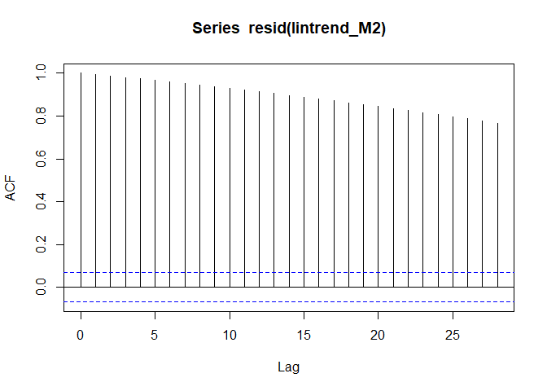
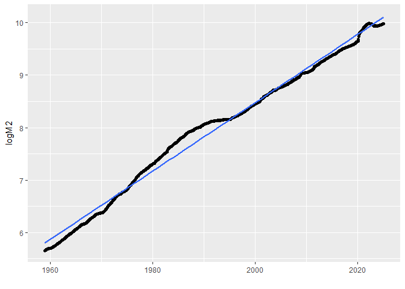
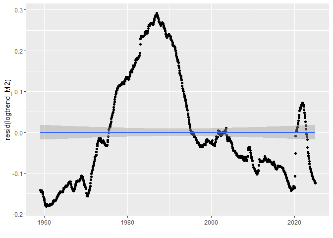
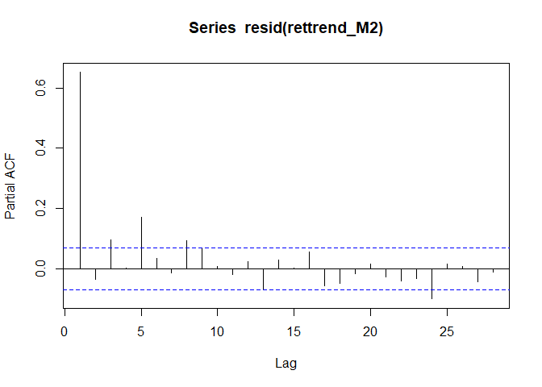
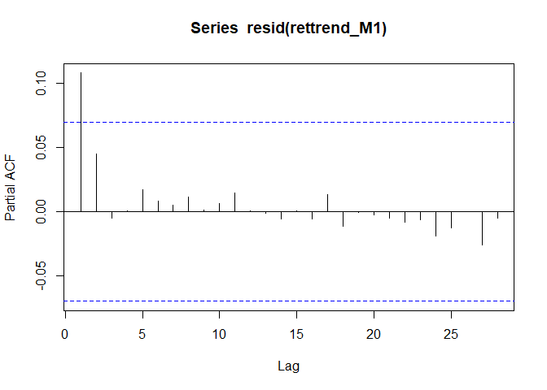
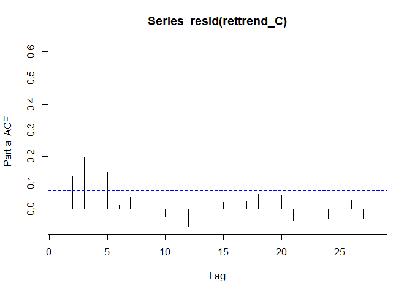
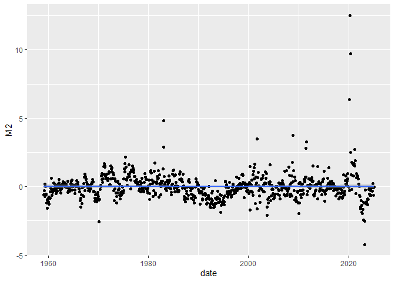

Analyzing the Expansion of the Money Supply
================

### R Packages

- The [fredr package](https://cran.r-project.org/package=fredr) is an R
  package that wraps the FRED API for easy importing of FRED data into
  R.
- The [dplyr package](https://cran.r-project.org/package=dplyr) package
  enables additional functionality for transforming data frames.
- The [xts package](https://cran.r-project.org/package=xts) allows for
  some additional time series functionality.
- The [ggplot2 package](https://cran.r-project.org/package=ggplot2)
  includes tools for generating graphics and visuals.
- The [rmarkdown package](https://cran.r-project.org/package=rmarkdown)
  is used to generate this R Notebook.

The first three lines in this setup chunk automatically install any R
packages that you may be missing. One note regarding any code chunk
labeled ‘setup’ is that the R Notebook will automatically run it prior
to any other code chunk.

``` r
list.of.packages <- c("fredr","dplyr","xts","ggplot2","rmarkdown")
new.packages <- list.of.packages[!(list.of.packages %in% installed.packages()[,"Package"])]
if(length(new.packages)) install.packages(new.packages)
library(fredr)
library(dplyr)
```

    ## 
    ## Attaching package: 'dplyr'

    ## The following objects are masked from 'package:stats':
    ## 
    ##     filter, lag

    ## The following objects are masked from 'package:base':
    ## 
    ##     intersect, setdiff, setequal, union

``` r
library(xts)
```

    ## Loading required package: zoo

    ## 
    ## Attaching package: 'zoo'

    ## The following objects are masked from 'package:base':
    ## 
    ##     as.Date, as.Date.numeric

    ## 
    ## ######################### Warning from 'xts' package ##########################
    ## #                                                                             #
    ## # The dplyr lag() function breaks how base R's lag() function is supposed to  #
    ## # work, which breaks lag(my_xts). Calls to lag(my_xts) that you type or       #
    ## # source() into this session won't work correctly.                            #
    ## #                                                                             #
    ## # Use stats::lag() to make sure you're not using dplyr::lag(), or you can add #
    ## # conflictRules('dplyr', exclude = 'lag') to your .Rprofile to stop           #
    ## # dplyr from breaking base R's lag() function.                                #
    ## #                                                                             #
    ## # Code in packages is not affected. It's protected by R's namespace mechanism #
    ## # Set `options(xts.warn_dplyr_breaks_lag = FALSE)` to suppress this warning.  #
    ## #                                                                             #
    ## ###############################################################################

    ## 
    ## Attaching package: 'xts'

    ## The following objects are masked from 'package:dplyr':
    ## 
    ##     first, last

``` r
library(ggplot2)
```

### FRED Data Import

To access the FRED API, you must first create an account and [request an
API key](https://fred.stlouisfed.org/docs/api/api_key.html). If you wish
to run the code and replicate the results, I encourage you to make an
account, generate your own API key, and run this command un-commented
with your key in place of the placeholder text.

``` r
#fredr_set_key("<YOUR-FRED-API-KEY>")
```

The fredr package lets us download data series from FRED. We will look
at three different measures of the money supply: M2, M1, and the
Currency Component of M1. M2 is the broadest definition of these,
followed by M1 and the Currency. The two M1 measures go back to 1975,
but we start in 1980 when the M2 starts being recorded for easier
comparison across the measures.

``` r
M2 = fredr(
  series_id = "M2SL",
  observation_start = as.Date("1959-01-01"),
  observation_end = as.Date(Sys.Date())
)
M1 = fredr(
  series_id = "M1SL",
  observation_start = as.Date("1959-01-01"),
  observation_end = as.Date(Sys.Date())
)
C = fredr(
  series_id = "CURRSL",
  observation_start = as.Date("1959-01-01"),
  observation_end = as.Date(Sys.Date())
)
```

### Reformatting and Merging Variables

We will then create a `xts` time series object, `ALL`, to collect all
three measurements into the same data element. This could be done with a
standard data frame; however, an xts object imposes the directed nature
of time into the data frame’s properties and opens the door to
additional functions from the xts package. So the first line here
creates the xts object ordering it by the date variable, the second line
renames the variable to indicate the particular measurement, and the
third line removes the extra variables that are not needed.

``` r
ALL = xts(M2,order.by=M2$date)
colnames(ALL)[colnames(ALL)=="value"] <- "M2"
ALL = subset(ALL,select=-c(date,series_id,realtime_start,realtime_end))
```

Similarly, we convert the M1 and Currency measurements into xts objects,
rename the variable, and then `merge()` the values to the `ALL` xts
object.

``` r
M1xts = xts(M1,order.by=M1$date)
colnames(M1xts)[colnames(M1xts)=="value"] <- "M1"
ALL = merge(ALL,M1xts$M1)
```

``` r
Cxts = xts(C,order.by=C$date)
colnames(Cxts)[colnames(Cxts)=="value"] <- "C"
ALL = merge(ALL,Cxts$C)
```

### Simple 2020 Stats

Before we dip deep into the data, let look at some simple answers to the
titular question and compute the percentage increase in each of the
money supply measures during 2020. First, we extract the observations
from the beginning and end of 2020. Then before calculating the percent
changes, we first need to convert those xts objects back to a numeric
vector using `as.double()`. This is done two different ways of in the
first two lines. The first line uses the infix operator `%>%` that feeds
the result of `ALL["2020-01"]` into the `as.double()` function. The
second line does the same for `ALL["2021-01"]`; however, it is formatted
as a nested function.

``` r
beg2020 = ALL["2020-01"] %>% as.double()
end2020 =  as.double(ALL["2021-01"])
((end2020-beg2020)/beg2020) %>% round(digits=4)
```

    ## [1] 0.2573 3.5491 0.1595

If we didn’t want to use an xts object for this, we could go back to the
raw data, search through the data frame to find the indices for the
start and end of 2020, and then manually calculate the percent changes
like this:

``` r
((M2$value[745]-M2$value[733])/M2$value[733]) %>% round(digits=4)
```

    ## [1] 0.2573

``` r
((M1$value[745]-M1$value[733])/M1$value[733]) %>% round(digits=4)
```

    ## [1] 3.5491

``` r
((C$value[745]-C$value[733])/C$value[733]) %>% round(digits=4)
```

    ## [1] 0.1595

Either way we calculate them, these figures document the substantial
monetary inflation throughout 2020. The M2 money stock grew by over 25%,
the M1 (with its definition change) grew by over 350%, and the Currency
component of M1 grew by 16%.

Another simple way we can address the question is to calculate the
percentage of money circulating at the end of 2020 that was printed
during 2020. In other words, divide the difference by the ending value,
rather than the beginning value.

``` r
((end2020-beg2020)/end2020) %>% round(digits=4)
```

    ## [1] 0.2046 0.7802 0.1376

Or:

``` r
((M2$value[745]-M2$value[733])/M2$value[745]) %>% round(digits=4)
```

    ## [1] 0.2046

``` r
((M1$value[745]-M1$value[733])/M1$value[745]) %>% round(digits=4)
```

    ## [1] 0.7802

``` r
((C$value[745]-C$value[733])/C$value[745]) %>% round(digits=4)
```

    ## [1] 0.1376

This gives an interpretation more along the lines of: considering the M2
definition, roughly 20% of all USD in circulation at the end of 2020 was
printed in that same year. If we consider the M1 and its definition
change, that value explodes to over 75%. The currency component shows a
far less severe, but still fairly large, 13.75%.

### A Deeper Dive

So how concerning are those numbers and where do they fit in
historically? Let’s dig a bit deeper.

#### Linear Trend Model

First, we will fit a linear time trend to the series and then examine
the residuals to see if 2020 is anomalous. This model would effectively
predict that the money supply should grow by the same dollar amount
every period, which is certainly not a great assumption to make, but it
is a good starting point.

To model a linear time trend, we need to generate a variable to measure
a one-period time increment. Rather than numbering the observations 1
through T, we’ll shift the zero-point forward so that the oldest
observation is -T and the most recent observation is -1. **Note: you
could achieve the same result by generating a sequence from 1:T;
however, then any forecasted predictions would begin at time T+1. With
this shifted time index, the intercept in the regression models will
predict the next observation, which would be at time 0.**

``` r
T = dim(C)[1]
ALL$t = -T:-1
```

With the time index created, we estimate a linear regression model
`lm()` of each money supply measurement on the time index. The
`summary()` function prints the regression estimates.

``` r
lintrend_M2 = lm(M2~t, data=ALL)
summary(lintrend_M2)
```

    ## 
    ## Call:
    ## lm(formula = M2 ~ t, data = ALL)
    ## 
    ## Residuals:
    ##     Min      1Q  Median      3Q     Max 
    ## -2810.7 -1900.6  -684.4  1386.5  8606.0 
    ## 
    ## Coefficients:
    ##              Estimate Std. Error t value Pr(>|t|)    
    ## (Intercept) 1.354e+04  1.803e+02   75.12   <2e-16 ***
    ## t           2.148e+01  4.005e-01   53.63   <2e-16 ***
    ## ---
    ## Signif. codes:  0 '***' 0.001 '**' 0.01 '*' 0.05 '.' 0.1 ' ' 1
    ## 
    ## Residual standard error: 2514 on 777 degrees of freedom
    ## Multiple R-squared:  0.7873, Adjusted R-squared:  0.787 
    ## F-statistic:  2876 on 1 and 777 DF,  p-value: < 2.2e-16

``` r
lintrend_M1 = lm(M1~t, data=ALL)
summary(lintrend_M1)
```

    ## 
    ## Call:
    ## lm(formula = M1 ~ t, data = ALL)
    ## 
    ## Residuals:
    ##     Min      1Q  Median      3Q     Max 
    ## -2836.7 -2024.9  -826.9   726.8 14676.6 
    ## 
    ## Coefficients:
    ##              Estimate Std. Error t value Pr(>|t|)    
    ## (Intercept) 6212.6011   249.6333   24.89   <2e-16 ***
    ## t             10.6986     0.5545   19.29   <2e-16 ***
    ## ---
    ## Signif. codes:  0 '***' 0.001 '**' 0.01 '*' 0.05 '.' 0.1 ' ' 1
    ## 
    ## Residual standard error: 3480 on 777 degrees of freedom
    ## Multiple R-squared:  0.3239, Adjusted R-squared:  0.323 
    ## F-statistic: 372.3 on 1 and 777 DF,  p-value: < 2.2e-16

``` r
lintrend_C = lm(C~t, data=ALL)
summary(lintrend_C)
```

    ## 
    ## Call:
    ## lm(formula = C ~ t, data = ALL)
    ## 
    ## Residuals:
    ##     Min      1Q  Median      3Q     Max 
    ## -280.37 -216.88  -88.46  173.00  833.30 
    ## 
    ## Coefficients:
    ##              Estimate Std. Error t value Pr(>|t|)    
    ## (Intercept) 1.426e+03  1.958e+01   72.81   <2e-16 ***
    ## t           2.319e+00  4.349e-02   53.31   <2e-16 ***
    ## ---
    ## Signif. codes:  0 '***' 0.001 '**' 0.01 '*' 0.05 '.' 0.1 ' ' 1
    ## 
    ## Residual standard error: 273 on 777 degrees of freedom
    ## Multiple R-squared:  0.7853, Adjusted R-squared:  0.7851 
    ## F-statistic:  2842 on 1 and 777 DF,  p-value: < 2.2e-16

Or alternatively, we can directly use the dates from the xts object as
our predictor variable. So instead of regression the money supply on t,
we regress it on `index(ALL)`, which creates a date array of the dates
ordering the xts object. If you look at the R-squared values, those are
equivalent to the previous models regressing on t. However, using the
dates as the predictor results in less interpretive coefficient
estimates. For example, the intercept no longer is the next prediction
in the forecast.

``` r
lintrend2_M2 = lm(M2~index(ALL), data=ALL)
summary(lintrend2_M2)
```

    ## 
    ## Call:
    ## lm(formula = M2 ~ index(ALL), data = ALL)
    ## 
    ## Residuals:
    ##     Min      1Q  Median      3Q     Max 
    ## -2810.3 -1900.6  -684.5  1386.0  8606.8 
    ## 
    ## Coefficients:
    ##               Estimate Std. Error t value Pr(>|t|)    
    ## (Intercept) -352.25446  136.75148  -2.576   0.0102 *  
    ## index(ALL)     0.70562    0.01316  53.630   <2e-16 ***
    ## ---
    ## Signif. codes:  0 '***' 0.001 '**' 0.01 '*' 0.05 '.' 0.1 ' ' 1
    ## 
    ## Residual standard error: 2514 on 777 degrees of freedom
    ## Multiple R-squared:  0.7873, Adjusted R-squared:  0.787 
    ## F-statistic:  2876 on 1 and 777 DF,  p-value: < 2.2e-16

``` r
lintrend2_M1 = lm(M1~index(ALL), data=ALL)
summary(lintrend2_M1)
```

    ## 
    ## Call:
    ## lm(formula = M1 ~ index(ALL), data = ALL)
    ## 
    ## Residuals:
    ##     Min      1Q  Median      3Q     Max 
    ## -2836.8 -2025.0  -827.0   726.9 14676.9 
    ## 
    ## Coefficients:
    ##               Estimate Std. Error t value Pr(>|t|)    
    ## (Intercept) -709.07479  189.35054  -3.745 0.000194 ***
    ## index(ALL)     0.35149    0.01822  19.294  < 2e-16 ***
    ## ---
    ## Signif. codes:  0 '***' 0.001 '**' 0.01 '*' 0.05 '.' 0.1 ' ' 1
    ## 
    ## Residual standard error: 3480 on 777 degrees of freedom
    ## Multiple R-squared:  0.3239, Adjusted R-squared:  0.323 
    ## F-statistic: 372.2 on 1 and 777 DF,  p-value: < 2.2e-16

``` r
lintrend2_C = lm(C~index(ALL), data=ALL)
summary(lintrend2_C)
```

    ## 
    ## Call:
    ## lm(formula = C ~ index(ALL), data = ALL)
    ## 
    ## Residuals:
    ##     Min      1Q  Median      3Q     Max 
    ## -280.34 -216.87  -88.38  173.00  833.35 
    ## 
    ## Coefficients:
    ##               Estimate Std. Error t value Pr(>|t|)    
    ## (Intercept) -74.624438  14.851976  -5.025 6.27e-07 ***
    ## index(ALL)    0.076184   0.001429  53.315  < 2e-16 ***
    ## ---
    ## Signif. codes:  0 '***' 0.001 '**' 0.01 '*' 0.05 '.' 0.1 ' ' 1
    ## 
    ## Residual standard error: 273 on 777 degrees of freedom
    ## Multiple R-squared:  0.7853, Adjusted R-squared:  0.7851 
    ## F-statistic:  2842 on 1 and 777 DF,  p-value: < 2.2e-16

To visualize the modeled relationship, we’ll use `ggplot2`. The
`geom_point()` function generates a scatterplot of the data points, and
the `geom_smooth()` function generates the estimated line of best fit
from a linear model (`method="lm"`).

``` r
ggplot(ALL,aes(y=M2,x=t))+geom_point()+geom_smooth(method="lm")
```

    ## `geom_smooth()` using formula = 'y ~ x'

<!-- -->

``` r
ggplot(ALL,aes(y=M1,x=t))+geom_point()+geom_smooth(method="lm")
```

    ## `geom_smooth()` using formula = 'y ~ x'

<!-- -->

``` r
ggplot(ALL,aes(y=C,x=t))+geom_point()+geom_smooth(method="lm")
```

    ## `geom_smooth()` using formula = 'y ~ x'

<!-- -->

When visualizing the relationship, we might wish to have the dates on
the x-axis instead. That is where using `index(ALL)` as the predictor
can be more beneficial. You can see that the modeled relationships are
identical, regardless of which time variable is used. The extra
`xlab("")` at the end overrides the default x axis label, which would
display index(ALL), which doesn’t add any value to the graphs.

``` r
ggplot(ALL,aes(y=M2,x=index(ALL)))+geom_point()+geom_smooth(method="lm")+xlab("")
```

    ## `geom_smooth()` using formula = 'y ~ x'

<!-- -->

``` r
ggplot(ALL,aes(y=M1,x=index(ALL)))+geom_point()+geom_smooth(method="lm")+xlab("")
```

    ## `geom_smooth()` using formula = 'y ~ x'

<!-- -->

``` r
ggplot(ALL,aes(y=C,x=index(ALL)))+geom_point()+geom_smooth(method="lm")+xlab("")
```

    ## `geom_smooth()` using formula = 'y ~ x'

<!-- -->

To evaluate the fit of our model and whether any assumptions have been
violated, we should examine the residuals (errors). We’ll extract these
from the linear models using the `resid()` function, and then replace
the y-values in the plot with the residual values. This effectively
adjusts the plots above to where the fitted blue line is horizontal, as
shown below.

``` r
ggplot(ALL,aes(y=resid(lintrend_M2),x=index(ALL)))+geom_point()+geom_smooth(method="lm")+xlab("")
```

    ## `geom_smooth()` using formula = 'y ~ x'

<!-- -->

``` r
ggplot(ALL,aes(y=resid(lintrend_M1),x=index(ALL)))+geom_point()+geom_smooth(method="lm")+xlab("")
```

    ## `geom_smooth()` using formula = 'y ~ x'

<!-- -->

``` r
ggplot(ALL,aes(y=resid(lintrend_C),x=index(ALL)))+geom_point()+geom_smooth(method="lm")+xlab("")
```

    ## `geom_smooth()` using formula = 'y ~ x'

<!-- -->

From those residual plots, there is very clear serial correlation and
non-randomness in the errors. This suggests functional mis-specification
of the model. See Chapter 7 regarding OLS assumptions, particularly
Assumption 4, which discusses serial correlation.

To directly test for serial correlation, we’ll use the autocorrelation
function (ACF) and partial autocorrelation function (PACF). The ACF
effectively measures the correlation between $e_t$ and $e_{t−1}$, and
then for $e_t$ and $e_{t−2}$, and so on for as many lags as desired. The
PACF is similar to the ACF, except it produces the estimates of each lag
after controlling for all shorter lags. In other words, rather than
measuring the correlation between $e_t$ and $e_{t−2}$, we’d measure the
linear regression coefficient for the second lag from a regression
including both the first and second lags.

``` r
acf(resid(lintrend_M2))
```

<!-- -->

``` r
pacf(resid(lintrend_M2))
```

<!-- -->

``` r
acf(resid(lintrend_M1))
```

<!-- -->

``` r
pacf(resid(lintrend_M1))
```

<!-- -->

``` r
acf(resid(lintrend_C))
```

<!-- -->

``` r
pacf(resid(lintrend_C))
```

<!-- -->

However, with these native `acf()` and `pacf()` plots, it appears that
the title gets cut off and isn’t as aesthetically pleasing as the ggplot
graphics. Below is a solution to replicating the ACF and PACF plots
using the the ggplot tools; however, it does not include the error bands
that can help with interpreting the plots. See this [Stack Overflow
Question](https://stackoverflow.com/questions/17788859/acf-plot-with-ggplot2-setting-width-of-geom-bar)
for a general example that we apply below.

``` r
lintrendacf_M2 = acf(resid(lintrend_M2), plot=FALSE)
linacfdf_M2 = with(lintrendacf_M2, data.frame(lag,acf))
ggplot(data = linacfdf_M2, mapping = aes(x = lag, y = acf)) +
  geom_hline(aes(yintercept = 0)) +
  geom_segment(mapping = aes(xend = lag, yend = 0))
```

<!-- -->

``` r
lintrendpacf_M2 = pacf(resid(lintrend_M2), plot=FALSE)
linpacfdf_M2 = with(lintrendpacf_M2, data.frame(lag,acf))
ggplot(data = linpacfdf_M2, mapping = aes(x = lag, y = acf)) +
  geom_hline(aes(yintercept = 0)) +
  geom_segment(mapping = aes(xend = lag, yend = 0))
```

<!-- -->

``` r
lintrendacf_M1 = acf(resid(lintrend_M1), plot=FALSE)
linacfdf_M1 = with(lintrendacf_M1, data.frame(lag,acf))
ggplot(data = linacfdf_M1, mapping = aes(x = lag, y = acf)) +
  geom_hline(aes(yintercept = 0)) +
  geom_segment(mapping = aes(xend = lag, yend = 0))
```

<!-- -->

``` r
lintrendpacf_M1 = pacf(resid(lintrend_M1), plot=FALSE)
linpacfdf_M1 = with(lintrendpacf_M1, data.frame(lag,acf))
ggplot(data = linpacfdf_M1, mapping = aes(x = lag, y = acf)) +
  geom_hline(aes(yintercept = 0)) +
  geom_segment(mapping = aes(xend = lag, yend = 0))
```

<!-- -->

``` r
lintrendacf_C = acf(resid(lintrend_C), plot=FALSE)
linacfdf_C = with(lintrendacf_C, data.frame(lag,acf))
ggplot(data = linacfdf_C, mapping = aes(x = lag, y = acf)) +
  geom_hline(aes(yintercept = 0)) +
  geom_segment(mapping = aes(xend = lag, yend = 0))
```

<!-- -->

``` r
lintrendpacf_C = pacf(resid(lintrend_C), plot=FALSE)
linpacfdf_C = with(lintrendpacf_C, data.frame(lag,acf))
ggplot(data = linpacfdf_C, mapping = aes(x = lag, y = acf)) +
  geom_hline(aes(yintercept = 0)) +
  geom_segment(mapping = aes(xend = lag, yend = 0))
```

<!-- -->

From the plots, we can see that the ACFs for each set of residuals
greatly exceeds the dashed blue error bands. Thus, we’ve documented the
clear autocorrelation (serial dependence) in the residuals.

#### Logarithmic Trend Model

The first step towards addressing this is to take the natural logarithm
of the money supply measures. Effectively, this can be thought of as
shifting the units from dollars to “percents” (the next step will be to
difference the values to get to “percent changes” in dollars or log
returns).

``` r
ALL$logM2 = log(ALL$M2)
ALL$logM1 = log(ALL$M1)
ALL$logC = log(ALL$C)
```

When running the logarithmic trend models, we can either replace the y
variable with our logged variable, or we can even apply the `log()`
function within the `lm()` function, as done in the last line of this
code chunk.

``` r
logtrend_M2 = lm(logM2~t, data=ALL)
logtrend_M1 = lm(logM1~t, data=ALL)
logtrend_C = lm(log(C)~t, data=ALL)
```

Now when we plot the fitted relationships, we see that the linear
relationship fits much more closely after logging the y variable.

``` r
ggplot(ALL,aes(y=logM2,x=index(ALL)))+geom_point()+geom_smooth(method="lm")+xlab("")
```

    ## `geom_smooth()` using formula = 'y ~ x'

<!-- -->

``` r
ggplot(ALL,aes(y=logM1,x=index(ALL)))+geom_point()+geom_smooth(method="lm")+xlab("")
```

    ## `geom_smooth()` using formula = 'y ~ x'

<!-- -->

``` r
ggplot(ALL,aes(y=logC,x=index(ALL)))+geom_point()+geom_smooth(method="lm")+xlab("")
```

    ## `geom_smooth()` using formula = 'y ~ x'

<!-- -->

If we examine the residuals, these look a bit better than the previous
regressions on the money supply levels. However, there still appears to
be some autocorrelation present.

``` r
ggplot(ALL,aes(y=resid(logtrend_M2),x=index(ALL)))+geom_point()+geom_smooth(method="lm")+xlab("")
```

    ## `geom_smooth()` using formula = 'y ~ x'

<!-- -->

``` r
ggplot(ALL,aes(y=resid(logtrend_M1),x=index(ALL)))+geom_point()+geom_smooth(method="lm")+xlab("")
```

    ## `geom_smooth()` using formula = 'y ~ x'

<!-- -->

``` r
ggplot(ALL,aes(y=resid(logtrend_C),x=index(ALL)))+geom_point()+geom_smooth(method="lm")+xlab("")
```

    ## `geom_smooth()` using formula = 'y ~ x'

<!-- -->

Now generate the ACF and PACF for the logarithmic trend models. These
show that there still is substantial serial correlation present in the
residuals.

``` r
acf(resid(logtrend_M2))
```

<!-- -->

``` r
pacf(resid(logtrend_M2))
```

<!-- -->

``` r
acf(resid(logtrend_M1))
```

<!-- -->

``` r
pacf(resid(logtrend_M1))
```

<!-- -->

``` r
acf(resid(logtrend_C))
```

<!-- -->

``` r
pacf(resid(logtrend_C))
```

<!-- -->

#### Log Return Trend Model

The way to address the issue of serial correlation here is also the
final step in transforming the money supply levels into continuously
compounded growth rates. This is done by differencing the logged values
from their prior observation’s logged value. This can be done with the
`diff()` function. *Note: when differencing observations, the earliest
observation is lost since we do not have a prior value and is replaced
by `NA`.*

``` r
ALL$retM2 = diff(ALL$logM2)
ALL$retM1 = diff(ALL$logM1)
ALL$retC = diff(ALL$logC)
```

These differenced logs give us the continuously compounded monthly
growth rate of each money supply measurement. If we regress these growth
rates on a time trend,

``` r
rettrend_M2 = lm(retM2~t, data=ALL)
summary(rettrend_M2)
```

    ## 
    ## Call:
    ## lm(formula = retM2 ~ t, data = ALL)
    ## 
    ## Residuals:
    ##       Min        1Q    Median        3Q       Max 
    ## -0.015296 -0.002327 -0.000190  0.001714  0.057103 
    ## 
    ## Coefficients:
    ##               Estimate Std. Error t value Pr(>|t|)    
    ## (Intercept)  4.612e-03  3.301e-04  13.970  < 2e-16 ***
    ## t           -2.294e-06  7.342e-07  -3.125  0.00184 ** 
    ## ---
    ## Signif. codes:  0 '***' 0.001 '**' 0.01 '*' 0.05 '.' 0.1 ' ' 1
    ## 
    ## Residual standard error: 0.004599 on 776 degrees of freedom
    ##   (1 observation deleted due to missingness)
    ## Multiple R-squared:  0.01243,    Adjusted R-squared:  0.01116 
    ## F-statistic: 9.766 on 1 and 776 DF,  p-value: 0.001844

``` r
rettrend_M1 = lm(retM1~t, data=ALL)
summary(rettrend_M1)
```

    ## 
    ## Call:
    ## lm(formula = retM1 ~ t, data = ALL)
    ## 
    ## Residuals:
    ##      Min       1Q   Median       3Q      Max 
    ## -0.04166 -0.00599 -0.00088  0.00253  1.20934 
    ## 
    ## Coefficients:
    ##              Estimate Std. Error t value Pr(>|t|)    
    ## (Intercept) 1.150e-02  3.183e-03   3.614  0.00032 ***
    ## t           1.348e-05  7.079e-06   1.904  0.05734 .  
    ## ---
    ## Signif. codes:  0 '***' 0.001 '**' 0.01 '*' 0.05 '.' 0.1 ' ' 1
    ## 
    ## Residual standard error: 0.04435 on 776 degrees of freedom
    ##   (1 observation deleted due to missingness)
    ## Multiple R-squared:  0.004648,   Adjusted R-squared:  0.003365 
    ## F-statistic: 3.623 on 1 and 776 DF,  p-value: 0.05734

``` r
rettrend_C = lm(retC~t, data=ALL)
summary(rettrend_C)
```

    ## 
    ## Call:
    ## lm(formula = retC ~ t, data = ALL)
    ## 
    ## Residuals:
    ##        Min         1Q     Median         3Q        Max 
    ## -0.0189451 -0.0018998  0.0000395  0.0018582  0.0189192 
    ## 
    ## Coefficients:
    ##              Estimate Std. Error t value Pr(>|t|)    
    ## (Intercept) 5.986e-03  2.379e-04  25.158   <2e-16 ***
    ## t           9.569e-07  5.292e-07   1.808    0.071 .  
    ## ---
    ## Signif. codes:  0 '***' 0.001 '**' 0.01 '*' 0.05 '.' 0.1 ' ' 1
    ## 
    ## Residual standard error: 0.003315 on 776 degrees of freedom
    ##   (1 observation deleted due to missingness)
    ## Multiple R-squared:  0.004196,   Adjusted R-squared:  0.002912 
    ## F-statistic:  3.27 on 1 and 776 DF,  p-value: 0.07096

If we examine the modeled relationships now, we see that the slope of
the time trend is close to zero across each measurement of the money
supply. This suggests that there isn’t a systematic long-term trend of
accelerating growth. However, we can still see many outliers around
major financial crises.

``` r
ggplot(ALL,aes(y=retM2,x=index(ALL)))+geom_point()+geom_smooth(method="lm")+xlab("")
```

    ## `geom_smooth()` using formula = 'y ~ x'

    ## Warning: Removed 1 rows containing non-finite values (`stat_smooth()`).

    ## Warning: Removed 1 rows containing missing values (`geom_point()`).

<!-- -->

``` r
ggplot(ALL,aes(y=retM1,x=index(ALL)))+geom_point()+geom_smooth(method="lm")+xlab("")
```

    ## `geom_smooth()` using formula = 'y ~ x'

    ## Warning: Removed 1 rows containing non-finite values (`stat_smooth()`).
    ## Removed 1 rows containing missing values (`geom_point()`).

<!-- -->

``` r
ggplot(ALL,aes(y=retC,x=index(ALL)))+geom_point()+geom_smooth(method="lm")+xlab("")
```

    ## `geom_smooth()` using formula = 'y ~ x'

    ## Warning: Removed 1 rows containing non-finite values (`stat_smooth()`).
    ## Removed 1 rows containing missing values (`geom_point()`).

<!-- -->

Now to examine the residuals. The `ALL[-1,]` here resolves an error that
arose from the missing value due to differencing. Since the slopes are
nearly zero, these residuals are very similar to the above regression
plots.

``` r
ggplot(ALL[-1,],aes(y=resid(rettrend_M2),x=index(ALL[-1,])))+geom_point()+geom_smooth(method="lm")+xlab("")
```

    ## `geom_smooth()` using formula = 'y ~ x'

<!-- -->

``` r
ggplot(ALL[-1,],aes(y=resid(rettrend_M1),x=index(ALL[-1,])))+geom_point()+geom_smooth(method="lm")+xlab("")
```

    ## `geom_smooth()` using formula = 'y ~ x'

<!-- -->

``` r
ggplot(ALL[-1,],aes(y=resid(rettrend_C),x=index(ALL[-1,])))+geom_point()+geom_smooth(method="lm")+xlab("")
```

    ## `geom_smooth()` using formula = 'y ~ x'

<!-- -->

Now we plot the ACF and PACF plots:

``` r
acf(resid(rettrend_M2))
```

<!-- -->

``` r
pacf(resid(rettrend_M2))
```

<!-- -->

``` r
acf(resid(rettrend_M1))
```

<!-- -->

``` r
pacf(resid(rettrend_M1))
```

<!-- -->

``` r
acf(resid(rettrend_C))
```

<!-- -->

``` r
pacf(resid(rettrend_C))
```

<!-- -->

So there is still some significant values in the ACFs and PACFs, but we
have certainly made substantial progress at reducing serial correlation
in the model by transforming the dollar values into log returns. The
next step would be to begin incorporating relevant economic factors into
the regression model to further explain the increase in the money
supply.

### Additional Insights

One additional insight gained from the log return models is that the
intercept term measures the model’s current estimate of monthly growth.
To convert this to an annualized growth rate, we multiply the intercept
estimate by 12.

``` r
rettrend_M2$coefficients[1]*12
```

    ## (Intercept) 
    ##   0.0553385

``` r
rettrend_M1$coefficients[1]*12
```

    ## (Intercept) 
    ##   0.1380513

``` r
rettrend_C$coefficients[1]*12
```

    ## (Intercept) 
    ##  0.07183563

Before we end, let’s revisit the original question once more. From our
log return models, let’s convert the residuals into z-scores by
subtracting the mean (which is 0 by construction of linear regression)
and dividing by the standard deviation.

``` r
Z = data.frame(date=index(ALL[-1,]))
e_mu_M2 = mean(rettrend_M2$residuals)
e_sd_M2 = sd(rettrend_M2$residuals)
Z$M2 = (rettrend_M2$residuals-e_mu_M2)/e_sd_M2
e_mu_M1 = mean(rettrend_M1$residuals)
e_sd_M1 = sd(rettrend_M1$residuals)
Z$M1 = (rettrend_M1$residuals-e_mu_M1)/e_sd_M1
e_mu_C = mean(rettrend_C$residuals)
e_sd_C = sd(rettrend_C$residuals)
Z$C = (rettrend_C$residuals-e_mu_C)/e_sd_C
```

Working off of the assumption that the errors (residuals) are normally
distributed, we can use these z-scores to identify outliers.

``` r
ggplot(Z,aes(y=M2,x=date))+geom_point()+geom_smooth(method="lm")
```

    ## `geom_smooth()` using formula = 'y ~ x'

<!-- -->

``` r
ggplot(Z,aes(y=M1,x=date))+geom_point()+geom_smooth(method="lm")
```

    ## `geom_smooth()` using formula = 'y ~ x'

<!-- -->

``` r
ggplot(Z,aes(y=C,x=date))+geom_point()+geom_smooth(method="lm")
```

    ## `geom_smooth()` using formula = 'y ~ x'

<!-- -->

If we consider the residuals of the log return model to be normally
distributed, then we would expect that z\>3 in less than 1% of
observations, and z\>5 would almost never occur. Lets count how many
exceed those thresholds.

``` r
sum(Z$M2>3)
```

    ## [1] 7

``` r
sum(Z$M1>3)
```

    ## [1] 1

``` r
sum(Z$C>3)
```

    ## [1] 8

``` r
sum(Z$M2>5)
```

    ## [1] 3

``` r
sum(Z$M1>5)
```

    ## [1] 1

``` r
sum(Z$C>5)
```

    ## [1] 1

Now let’s count how many of those occurred in 2020.

``` r
sum(Z$M2[732:744]>3)
```

    ## [1] 3

``` r
sum(Z$M1[732:744]>3)
```

    ## [1] 1

``` r
sum(Z$C[732:744]>3)
```

    ## [1] 3

``` r
sum(Z$M2[732:744]>5)
```

    ## [1] 3

``` r
sum(Z$M1[732:744]>5)
```

    ## [1] 1

``` r
sum(Z$C[732:744]>5)
```

    ## [1] 0
