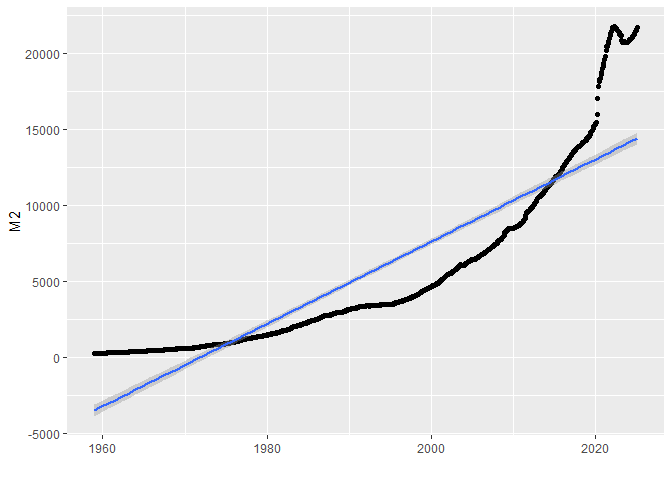
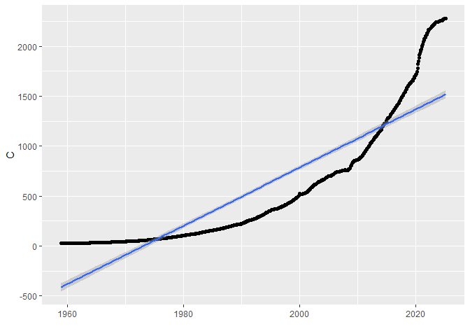
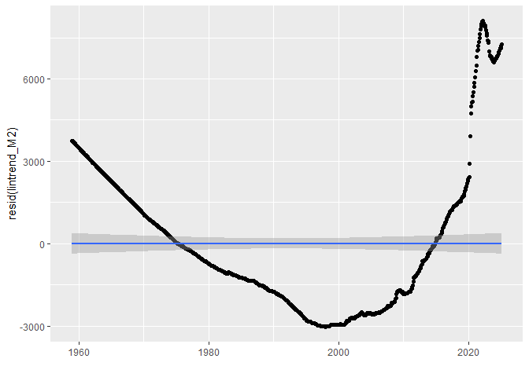
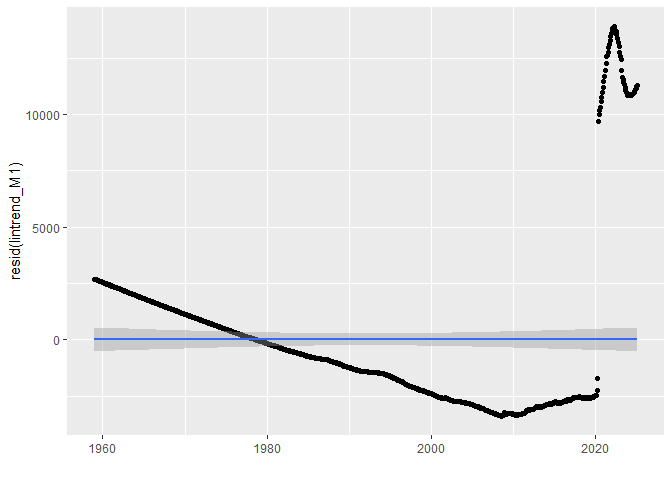
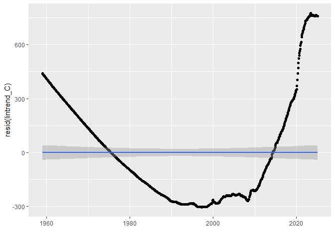
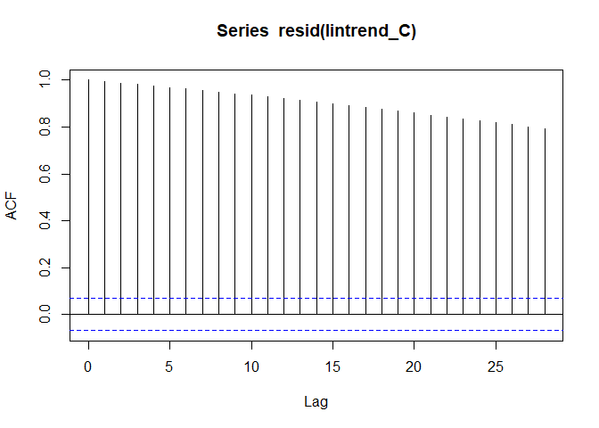
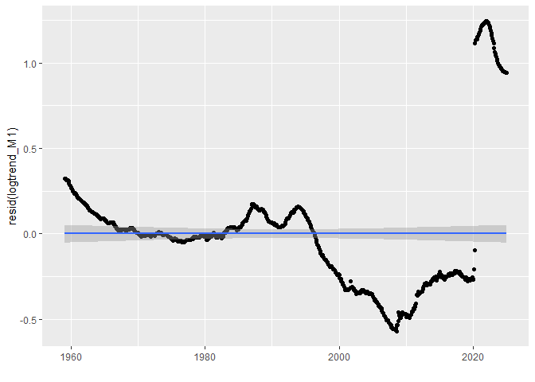
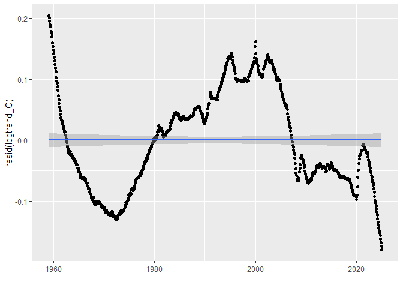
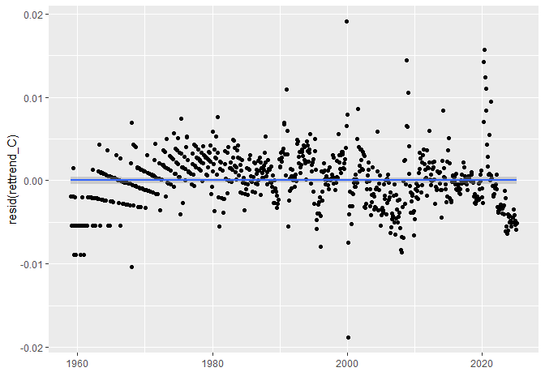
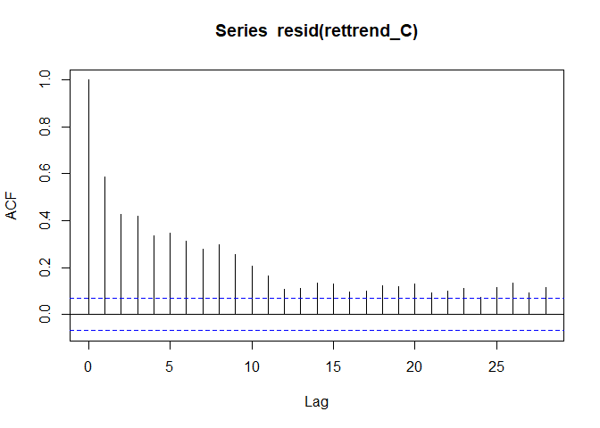

Analyzing the Expansion of the Money Supply
================
Last updated: 2026-01-12

## Preliminary Work: Install/Load Packages

To try and ensure that this R Notebook will run successfully, we’ll use
the [renv
package](https://cran.r-project.org/web/packages/renv/index.html) to
create a project-specific library of packages. This will allow us to
install the packages that we need for this project without affecting any
other projects that we may be working on. Additionally, the project
library will track the specific versions of the dependency packages so
that any updates to those packages will not break this project.

The code chunk below will first install the renv package if it is not
already installed. Then we will load the package. Next, we’ll use the
`restore()` function to install any packages listed in the renv.lock
file. Once these packages are installed, we can load them into the R
session using the `library()` commands. Below the code chunk, we’ll list
out the packages that will be used in the project demo.

``` r
# Install renv package if not already installed
if(!"renv" %in% installed.packages()[,"Package"]) install.packages("renv")
# Load renv package
library(renv)
# Use restore() to install any packages listed in the renv.lock file
renv::restore(clean=TRUE, lockfile="../renv.lock")
# Load in the packages
library(fredr)
library(dplyr)
library(xts)
library(ggplot2)
library(rmarkdown)
```

- The [fredr package](https://cran.r-project.org/package=fredr) is an R
  package that wraps the [FRED
  API](https://fred.stlouisfed.org/docs/api/fred/) for easy importing of
  FRED data into R.
- The [dplyr package](https://cran.r-project.org/package=dplyr) package
  enables additional functionality for transforming data frames.
- The [xts package](https://cran.r-project.org/package=xts) allows for
  some additional time series functionality.
- The [ggplot2 package](https://cran.r-project.org/package=ggplot2)
  includes tools for generating graphics and visuals.
- The [rmarkdown package](https://cran.r-project.org/package=rmarkdown)
  is used to generate this R Notebook.

Since the rmarkdown functionality is built into RStudio, this one is
automatically loaded when we open the RStudio. So no need to use the
`library()` function for this one. Another observation to make about the
code chunk above is that it is labeled as ‘setup’, which is a special
name, which the R Notebook will recognize and automatically run prior to
running any other code chunk. This is useful for loading in packages and
setting up other global options that will be used throughout the
notebook.

Then if you wish to try and update the versions of the various R
packages in the lock file, you can use the `renv::update()` function to
update the packages in the project library. However, it is possible that
these updates could break the code in this notebook. If so, you may need
to adapt the code to work with the updated packages.

My recommendation is to first run through the code using the versions of
the packages in the lock file. Then if you want to try and update the
packages, you can do so and then run through the code again to see if it
still works. If not, you can always revert back to the lock file
versions using the `renv::restore()` function.

If you update the packages and get everything working successfully, then
you can update the lock file using the `renv::snapshot()` function. This
will update the lock file with the versions of the packages that are
currently installed in the project library. Then you can commit the
updated lock file to the repository so that others can use the updated
versions of the packages.

## FRED Data Import

To access the FRED API, you must first create an account and [request an
API key](https://fred.stlouisfed.org/docs/api/api_key.html). If you wish
to run the code and replicate the results, you need to make an account,
generate an API key, save it in a plain text file named “fredapikey”,
and run this command. The `scan` function will load the text, and the
`fredr_set_key` function will set the key for the `fredr` package.

``` r
fredr_set_key(scan("fredapikey", what="character"))
```

The fredr package lets us download data series from FRED. We will look
at three different measures of the money supply: M2, M1, and the
Currency Component of M1. M2 is the broadest definition of these,
followed by M1 and the Currency. The two M1 measures go back to 1975,
but we start in 1980 when the M2 starts being recorded for easier
comparison across the measures.

``` r
M2 = fredr(
  series_id="M2SL",
  observation_start=as.Date("1959-01-01"),
  observation_end=as.Date(Sys.Date())
)
M1 = fredr(
  series_id="M1SL",
  observation_start=as.Date("1959-01-01"),
  observation_end=as.Date(Sys.Date())
)
C = fredr(
  series_id="CURRSL",
  observation_start=as.Date("1959-01-01"),
  observation_end=as.Date(Sys.Date())
)
```

## Reformatting and Merging Variables

We will then create a `xts` time series object, `ALL`, to collect all
three measurements into the same data element. This could be done with a
standard data frame; however, an xts object imposes the directed nature
of time into the data frame’s properties and opens the door to
additional functions from the xts package. So the first line here
creates the xts object ordering it by the date variable, the second line
renames the variable to indicate the particular measurement, and the
third line removes the extra variables that are not needed.

``` r
ALL = xts(M2,order.by=M2$date)
colnames(ALL)[colnames(ALL)=="value"] = "M2"
ALL = subset(ALL,select=-c(date,series_id,realtime_start,realtime_end))
```

Similarly, we convert the M1 and Currency measurements into xts objects,
rename the variable, and then `merge()` the values to the `ALL` xts
object.

``` r
M1xts = xts(M1,order.by=M1$date)
colnames(M1xts)[colnames(M1xts)=="value"] = "M1"
ALL = merge(ALL,M1xts$M1)
```

``` r
Cxts = xts(C,order.by=C$date)
colnames(Cxts)[colnames(Cxts)=="value"] = "C"
ALL = merge(ALL,Cxts$C)
```

## 2020 Stats

Before we dive deeper into the data, let’s look at the outlier year of
2020. First, we can simply compute the percentage increase in each of
the money supply measures during 2020. First, we identify the levels for
the beginning and end of 2020. Then, before calculating the percent
changes, we first need to convert those xts objects back to a numeric
vector using the `as.double()` function. To demonstrate two different
ways of applying a function, the first line uses the infix operator `|>`
that feeds the result of `ALL["2020-01"]` into the `as.double()`
function. The second line does the same for `ALL["2021-01"]`; however,
it is formatted as a nested function. The third line then calculates the
percent change and rounds the result to 4 digits.

``` r
beg2020 = ALL["2020-01"] |> as.double()
end2020 =  as.double(ALL["2021-01"])
((end2020-beg2020)/beg2020) |> round(digits=4)
```

    ## [1] 0.2558 3.5343 0.1600

Alternatively, if we didn’t want to use the xts object for this, we
could go back to the raw data, search manually through the data frame to
find the indices for the start and end of 2020, and then manually
calculate the percent changes like this:

``` r
((M2$value[745]-M2$value[733])/M2$value[733]) |> round(digits=4)
```

    ## [1] 0.2558

``` r
((M1$value[745]-M1$value[733])/M1$value[733]) |> round(digits=4)
```

    ## [1] 3.5343

``` r
((C$value[745]-C$value[733])/C$value[733]) |> round(digits=4)
```

    ## [1] 0.16

Either way we calculate them, these figures document the substantial
monetary inflation throughout 2020. The M2 money stock grew by over 25%,
the M1 (with its definition change) grew by over 350%, and the Currency
component of M1 grew by 16%.

Another simple calculation is the percentage of money circulating at the
end of 2020 that was printed during 2020. In other words, divide the
difference by the ending value, rather than the beginning value.

``` r
((end2020-beg2020)/end2020) |> round(digits=4)
```

    ## [1] 0.2037 0.7795 0.1379

Or:

``` r
((M2$value[745]-M2$value[733])/M2$value[745]) |> round(digits=4)
```

    ## [1] 0.2037

``` r
((M1$value[745]-M1$value[733])/M1$value[745]) |> round(digits=4)
```

    ## [1] 0.7795

``` r
((C$value[745]-C$value[733])/C$value[745]) |> round(digits=4)
```

    ## [1] 0.1379

This gives an interpretation more along the lines of: considering the M2
definition, roughly 20% of all USD in circulation at the end of 2020 was
printed in that same year. If we consider the M1 and its definition
change, that value explodes to over 75%. The currency component shows a
far less severe, but still fairly large, 13.75%.

## A Deeper Dive

So how concerning are those figures and where do they fit in
historically? Let’s dig a bit deeper.

### Linear Trend Model

First, we will fit a linear time trend to the series and then examine
the residuals to see if 2020 is anomalous. This model would effectively
predict that the money supply should grow by the same dollar amount
every period, which is certainly not a great assumption to make, but it
is a good starting point.

To model a linear time trend, we need to generate a variable to measure
a one-period time increment. Rather than numbering the observations 1
through T, we’ll shift the zero-point forward so that the oldest
observation is -T and the most recent observation is -1. **Note: you
could achieve the same result by generating a sequence from 1:T;
however, then any forecasted predictions would begin at time T+1. With
this shifted time index, the intercept in the regression models will
predict the next observation, which would be at time 0.**

``` r
T = dim(C)[1]
ALL$t = -T:-1
```

With the time index created, we estimate a linear regression model
`lm()` of each money supply measurement on the time index. The
`summary()` function prints the regression estimates.

``` r
lintrend_M2 = lm(M2~t, data=ALL)
summary(lintrend_M2)
```

    ## 
    ## Call:
    ## lm(formula = M2 ~ t, data = ALL)
    ## 
    ## Residuals:
    ##     Min      1Q  Median      3Q     Max 
    ## -3151.7 -2173.7  -748.6  1427.9  7805.2 
    ## 
    ## Coefficients:
    ##              Estimate Std. Error t value Pr(>|t|)    
    ## (Intercept) 1.496e+04  1.958e+02   76.43   <2e-16 ***
    ## t           2.315e+01  4.219e-01   54.88   <2e-16 ***
    ## ---
    ## Signif. codes:  0 '***' 0.001 '**' 0.01 '*' 0.05 '.' 0.1 ' ' 1
    ## 
    ## Residual standard error: 2771 on 801 degrees of freedom
    ## Multiple R-squared:  0.7899, Adjusted R-squared:  0.7896 
    ## F-statistic:  3011 on 1 and 801 DF,  p-value: < 2.2e-16

``` r
lintrend_M1 = lm(M1~t, data=ALL)
summary(lintrend_M1)
```

    ## 
    ## Call:
    ## lm(formula = M1 ~ t, data = ALL)
    ## 
    ## Residuals:
    ##     Min      1Q  Median      3Q     Max 
    ## -3700.6 -2967.3  -928.1  1236.1 13437.8 
    ## 
    ## Coefficients:
    ##              Estimate Std. Error t value Pr(>|t|)    
    ## (Intercept) 7874.6734   278.8149   28.24   <2e-16 ***
    ## t             13.3015     0.6008   22.14   <2e-16 ***
    ## ---
    ## Signif. codes:  0 '***' 0.001 '**' 0.01 '*' 0.05 '.' 0.1 ' ' 1
    ## 
    ## Residual standard error: 3947 on 801 degrees of freedom
    ## Multiple R-squared:  0.3796, Adjusted R-squared:  0.3788 
    ## F-statistic: 490.1 on 1 and 801 DF,  p-value: < 2.2e-16

``` r
lintrend_C = lm(C~t, data=ALL)
summary(lintrend_C)
```

    ## 
    ## Call:
    ## lm(formula = C ~ t, data = ALL)
    ## 
    ## Residuals:
    ##    Min     1Q Median     3Q    Max 
    ## -315.6 -258.2  -90.2  200.5  763.1 
    ## 
    ## Coefficients:
    ##              Estimate Std. Error t value Pr(>|t|)    
    ## (Intercept) 1.578e+03  2.125e+01   74.27   <2e-16 ***
    ## t           2.498e+00  4.579e-02   54.56   <2e-16 ***
    ## ---
    ## Signif. codes:  0 '***' 0.001 '**' 0.01 '*' 0.05 '.' 0.1 ' ' 1
    ## 
    ## Residual standard error: 300.8 on 801 degrees of freedom
    ## Multiple R-squared:  0.788,  Adjusted R-squared:  0.7877 
    ## F-statistic:  2976 on 1 and 801 DF,  p-value: < 2.2e-16

Or alternatively, we can directly use the dates from the xts object as
our predictor variable. So instead of regression the money supply on t,
we regress it on `index(ALL)`, which creates a date array of the dates
ordering the xts object. If you look at the R-squared values, those are
equivalent to the previous models regressing on t. However, using the
dates as the predictor results in less interpretive coefficient
estimates. For example, the intercept no longer is the next prediction
in the forecast.

``` r
lintrend2_M2 = lm(M2~index(ALL), data=ALL)
summary(lintrend2_M2)
```

    ## 
    ## Call:
    ## lm(formula = M2 ~ index(ALL), data = ALL)
    ## 
    ## Residuals:
    ##     Min      1Q  Median      3Q     Max 
    ## -3152.2 -2173.8  -748.6  1427.9  7805.6 
    ## 
    ## Coefficients:
    ##               Estimate Std. Error t value Pr(>|t|)    
    ## (Intercept) -570.41697  149.80248  -3.808 0.000151 ***
    ## index(ALL)     0.76062    0.01386  54.876  < 2e-16 ***
    ## ---
    ## Signif. codes:  0 '***' 0.001 '**' 0.01 '*' 0.05 '.' 0.1 ' ' 1
    ## 
    ## Residual standard error: 2771 on 801 degrees of freedom
    ## Multiple R-squared:  0.7899, Adjusted R-squared:  0.7896 
    ## F-statistic:  3011 on 1 and 801 DF,  p-value: < 2.2e-16

``` r
lintrend2_M1 = lm(M1~index(ALL), data=ALL)
summary(lintrend2_M1)
```

    ## 
    ## Call:
    ## lm(formula = M1 ~ index(ALL), data = ALL)
    ## 
    ## Residuals:
    ##    Min     1Q Median     3Q    Max 
    ##  -3701  -2967   -928   1236  13438 
    ## 
    ## Coefficients:
    ##               Estimate Std. Error t value Pr(>|t|)    
    ## (Intercept) -1.050e+03  2.133e+02  -4.923 1.03e-06 ***
    ## index(ALL)   4.370e-01  1.974e-02  22.138  < 2e-16 ***
    ## ---
    ## Signif. codes:  0 '***' 0.001 '**' 0.01 '*' 0.05 '.' 0.1 ' ' 1
    ## 
    ## Residual standard error: 3947 on 801 degrees of freedom
    ## Multiple R-squared:  0.3796, Adjusted R-squared:  0.3788 
    ## F-statistic: 490.1 on 1 and 801 DF,  p-value: < 2.2e-16

``` r
lintrend2_C = lm(C~index(ALL), data=ALL)
summary(lintrend2_C)
```

    ## 
    ## Call:
    ## lm(formula = C ~ index(ALL), data = ALL)
    ## 
    ## Residuals:
    ##     Min      1Q  Median      3Q     Max 
    ## -315.67 -258.25  -90.17  200.43  763.00 
    ## 
    ## Coefficients:
    ##               Estimate Std. Error t value Pr(>|t|)    
    ## (Intercept) -98.135526  16.259682  -6.036 2.42e-09 ***
    ## index(ALL)    0.082079   0.001504  54.557  < 2e-16 ***
    ## ---
    ## Signif. codes:  0 '***' 0.001 '**' 0.01 '*' 0.05 '.' 0.1 ' ' 1
    ## 
    ## Residual standard error: 300.8 on 801 degrees of freedom
    ## Multiple R-squared:  0.788,  Adjusted R-squared:  0.7877 
    ## F-statistic:  2976 on 1 and 801 DF,  p-value: < 2.2e-16

To visualize the modeled relationship, we’ll use `ggplot2`. The
`geom_point()` function generates a scatterplot of the data points, and
the `geom_smooth()` function generates the estimated line of best fit
from a linear model (`method="lm"`).

``` r
ggplot(ALL,aes(y=M2,x=t))+geom_point()+geom_smooth(method="lm")
```

    ## `geom_smooth()` using formula = 'y ~ x'

<!-- -->

``` r
ggplot(ALL,aes(y=M1,x=t))+geom_point()+geom_smooth(method="lm")
```

    ## `geom_smooth()` using formula = 'y ~ x'

<!-- -->

``` r
ggplot(ALL,aes(y=C,x=t))+geom_point()+geom_smooth(method="lm")
```

    ## `geom_smooth()` using formula = 'y ~ x'

<!-- -->

When visualizing the relationship, we might wish to have the dates on
the x-axis instead. That is where using `index(ALL)` as the predictor
can be more beneficial. You can see that the modeled relationships are
identical, regardless of which time variable is used. The extra
`xlab("")` at the end overrides the default x axis label, which would
display index(ALL), which doesn’t add any value to the graphs.

``` r
ggplot(ALL,aes(y=M2,x=index(ALL)))+geom_point()+geom_smooth(method="lm")+xlab("")
```

    ## `geom_smooth()` using formula = 'y ~ x'

<!-- -->

``` r
ggplot(ALL,aes(y=M1,x=index(ALL)))+geom_point()+geom_smooth(method="lm")+xlab("")
```

    ## `geom_smooth()` using formula = 'y ~ x'

<!-- -->

``` r
ggplot(ALL,aes(y=C,x=index(ALL)))+geom_point()+geom_smooth(method="lm")+xlab("")
```

    ## `geom_smooth()` using formula = 'y ~ x'

<!-- -->

To evaluate the fit of our model and whether any assumptions have been
violated, we should examine the residuals (errors). We’ll extract these
from the linear models using the `resid()` function, and then replace
the y-values in the plot with the residual values. This effectively
adjusts the plots above to where the fitted blue line is horizontal, as
shown below.

``` r
ggplot(ALL,aes(y=resid(lintrend_M2),x=index(ALL)))+geom_point()+geom_smooth(method="lm")+xlab("")
```

    ## `geom_smooth()` using formula = 'y ~ x'

<!-- -->

``` r
ggplot(ALL,aes(y=resid(lintrend_M1),x=index(ALL)))+geom_point()+geom_smooth(method="lm")+xlab("")
```

    ## `geom_smooth()` using formula = 'y ~ x'

<!-- -->

``` r
ggplot(ALL,aes(y=resid(lintrend_C),x=index(ALL)))+geom_point()+geom_smooth(method="lm")+xlab("")
```

    ## `geom_smooth()` using formula = 'y ~ x'

<!-- -->

From those residual plots, there is very clear serial correlation and
non-randomness in the errors. This suggests functional mis-specification
of the model. See Chapter 7 regarding OLS assumptions, particularly
Assumption 4, which discusses serial correlation.

To directly test for serial correlation, we’ll use the autocorrelation
function (ACF) and partial autocorrelation function (PACF). The ACF
effectively measures the correlation between $e_t$ and $e_{t−1}$, and
then for $e_t$ and $e_{t−2}$, and so on for as many lags as desired. The
PACF is similar to the ACF, except it produces the estimates of each lag
after controlling for all shorter lags. In other words, rather than
measuring the correlation between $e_t$ and $e_{t−2}$, we’d measure the
linear regression coefficient for the second lag from a regression
including both the first and second lags.

``` r
acf(resid(lintrend_M2))
```

<!-- -->

``` r
pacf(resid(lintrend_M2))
```

<!-- -->

``` r
acf(resid(lintrend_M1))
```

<!-- -->

``` r
pacf(resid(lintrend_M1))
```

<!-- -->

``` r
acf(resid(lintrend_C))
```

<!-- -->

``` r
pacf(resid(lintrend_C))
```

<!-- -->

From the plots, we can see that the ACFs for each set of residuals
greatly exceeds the dashed blue error bands. Thus, we’ve documented the
clear autocorrelation (serial dependence) in the residuals.

### Logarithmic Trend Model

The first step towards addressing this is to take the natural logarithm
of the money supply measures. Effectively, this can be thought of as
shifting the units from dollars to “percents” (the next step will be to
difference the values to get to “percent changes” in dollars or log
returns).

``` r
ALL$logM2 = log(ALL$M2)
ALL$logM1 = log(ALL$M1)
ALL$logC = log(ALL$C)
```

When running the logarithmic trend models, we can either replace the y
variable with our logged variable, or we can even apply the `log()`
function within the `lm()` function, as done in the last line of this
code chunk.

``` r
logtrend_M2 = lm(logM2~t, data=ALL)
logtrend_M1 = lm(logM1~t, data=ALL)
logtrend_C = lm(log(C)~t, data=ALL)
```

Now when we plot the fitted relationships, we see that the linear
relationship fits much more closely after logging the y variable.

``` r
ggplot(ALL,aes(y=logM2,x=index(ALL)))+geom_point()+geom_smooth(method="lm")+xlab("")
```

    ## `geom_smooth()` using formula = 'y ~ x'

<!-- -->

``` r
ggplot(ALL,aes(y=logM1,x=index(ALL)))+geom_point()+geom_smooth(method="lm")+xlab("")
```

    ## `geom_smooth()` using formula = 'y ~ x'

<!-- -->

``` r
ggplot(ALL,aes(y=logC,x=index(ALL)))+geom_point()+geom_smooth(method="lm")+xlab("")
```

    ## `geom_smooth()` using formula = 'y ~ x'

<!-- -->

If we examine the residuals, these look a bit better than the previous
regressions on the money supply levels. However, there still appears to
be some autocorrelation present.

``` r
ggplot(ALL,aes(y=resid(logtrend_M2),x=index(ALL)))+geom_point()+geom_smooth(method="lm")+xlab("")
```

    ## `geom_smooth()` using formula = 'y ~ x'

<!-- -->

``` r
ggplot(ALL,aes(y=resid(logtrend_M1),x=index(ALL)))+geom_point()+geom_smooth(method="lm")+xlab("")
```

    ## `geom_smooth()` using formula = 'y ~ x'

<!-- -->

``` r
ggplot(ALL,aes(y=resid(logtrend_C),x=index(ALL)))+geom_point()+geom_smooth(method="lm")+xlab("")
```

    ## `geom_smooth()` using formula = 'y ~ x'

<!-- -->

Now generate the ACF and PACF for the logarithmic trend models. These
show that there still is substantial serial correlation present in the
residuals.

``` r
acf(resid(logtrend_M2))
```

<!-- -->

``` r
pacf(resid(logtrend_M2))
```

<!-- -->

``` r
acf(resid(logtrend_M1))
```

<!-- -->

``` r
pacf(resid(logtrend_M1))
```

<!-- -->

``` r
acf(resid(logtrend_C))
```

<!-- -->

``` r
pacf(resid(logtrend_C))
```

<!-- -->

### Log Return Trend Model

The way to address the issue of serial correlation here is also the
final step in transforming the money supply levels into continuously
compounded growth rates. This is done by differencing the logged values
from their prior observation’s logged value. This can be done with the
`diff()` function. *Note: when differencing observations, the earliest
observation is lost since we do not have a prior value and is replaced
by `NA`.*

``` r
ALL$retM2 = diff(ALL$logM2)
ALL$retM1 = diff(ALL$logM1)
ALL$retC = diff(ALL$logC)
```

These differenced logs give us the continuously compounded monthly
growth rate of each money supply measurement. If we regress these growth
rates on a time trend,

``` r
rettrend_M2 = lm(retM2~t, data=ALL)
summary(rettrend_M2)
```

    ## 
    ## Call:
    ## lm(formula = retM2 ~ t, data = ALL)
    ## 
    ## Residuals:
    ##       Min        1Q    Median        3Q       Max 
    ## -0.019122 -0.002288 -0.000268  0.001658  0.056805 
    ## 
    ## Coefficients:
    ##               Estimate Std. Error t value Pr(>|t|)    
    ## (Intercept)  4.370e-03  3.199e-04  13.661  < 2e-16 ***
    ## t           -2.640e-06  6.903e-07  -3.825 0.000141 ***
    ## ---
    ## Signif. codes:  0 '***' 0.001 '**' 0.01 '*' 0.05 '.' 0.1 ' ' 1
    ## 
    ## Residual standard error: 0.004526 on 800 degrees of freedom
    ##   (1 observation deleted due to missingness)
    ## Multiple R-squared:  0.01796,    Adjusted R-squared:  0.01673 
    ## F-statistic: 14.63 on 1 and 800 DF,  p-value: 0.0001408

``` r
rettrend_M1 = lm(retM1~t, data=ALL)
summary(rettrend_M1)
```

    ## 
    ## Call:
    ## lm(formula = retM1 ~ t, data = ALL)
    ## 
    ## Residuals:
    ##      Min       1Q   Median       3Q      Max 
    ## -0.04115 -0.00611 -0.00092  0.00249  1.20749 
    ## 
    ## Coefficients:
    ##              Estimate Std. Error t value Pr(>|t|)    
    ## (Intercept) 1.072e-02  3.083e-03   3.478 0.000532 ***
    ## t           1.143e-05  6.651e-06   1.718 0.086167 .  
    ## ---
    ## Signif. codes:  0 '***' 0.001 '**' 0.01 '*' 0.05 '.' 0.1 ' ' 1
    ## 
    ## Residual standard error: 0.04361 on 800 degrees of freedom
    ##   (1 observation deleted due to missingness)
    ## Multiple R-squared:  0.003676,   Adjusted R-squared:  0.002431 
    ## F-statistic: 2.952 on 1 and 800 DF,  p-value: 0.08617

``` r
rettrend_C = lm(retC~t, data=ALL)
summary(rettrend_C)
```

    ## 
    ## Call:
    ## lm(formula = retC ~ t, data = ALL)
    ## 
    ## Residuals:
    ##        Min         1Q     Median         3Q        Max 
    ## -0.0187300 -0.0020663  0.0001074  0.0018323  0.0191325 
    ## 
    ## Coefficients:
    ##              Estimate Std. Error t value Pr(>|t|)    
    ## (Intercept) 5.504e-03  2.360e-04   23.32   <2e-16 ***
    ## t           2.055e-08  5.092e-07    0.04    0.968    
    ## ---
    ## Signif. codes:  0 '***' 0.001 '**' 0.01 '*' 0.05 '.' 0.1 ' ' 1
    ## 
    ## Residual standard error: 0.003338 on 800 degrees of freedom
    ##   (1 observation deleted due to missingness)
    ## Multiple R-squared:  2.037e-06,  Adjusted R-squared:  -0.001248 
    ## F-statistic: 0.00163 on 1 and 800 DF,  p-value: 0.9678

If we examine the modeled relationships now, we see that the slope of
the time trend is close to zero across each measurement of the money
supply. This suggests that there isn’t a systematic long-term trend of
accelerating growth. However, we can still see many outliers around
major financial crises.

``` r
ggplot(ALL,aes(y=retM2,x=index(ALL)))+geom_point()+geom_smooth(method="lm")+xlab("")
```

    ## `geom_smooth()` using formula = 'y ~ x'

    ## Warning: Removed 1 row containing non-finite outside the scale range
    ## (`stat_smooth()`).

    ## Warning: Removed 1 row containing missing values or values outside the scale range
    ## (`geom_point()`).

<!-- -->

``` r
ggplot(ALL,aes(y=retM1,x=index(ALL)))+geom_point()+geom_smooth(method="lm")+xlab("")
```

    ## `geom_smooth()` using formula = 'y ~ x'

    ## Warning: Removed 1 row containing non-finite outside the scale range (`stat_smooth()`).
    ## Removed 1 row containing missing values or values outside the scale range
    ## (`geom_point()`).

<!-- -->

``` r
ggplot(ALL,aes(y=retC,x=index(ALL)))+geom_point()+geom_smooth(method="lm")+xlab("")
```

    ## `geom_smooth()` using formula = 'y ~ x'

    ## Warning: Removed 1 row containing non-finite outside the scale range (`stat_smooth()`).
    ## Removed 1 row containing missing values or values outside the scale range
    ## (`geom_point()`).

<!-- -->

Now to examine the residuals. The `ALL[-1,]` here resolves an error that
arose from the missing value due to differencing. Since the slopes are
nearly zero, these residuals are very similar to the above regression
plots.

``` r
ggplot(ALL[-1,],aes(y=resid(rettrend_M2),x=index(ALL[-1,])))+geom_point()+geom_smooth(method="lm")+xlab("")
```

    ## `geom_smooth()` using formula = 'y ~ x'

<!-- -->

``` r
ggplot(ALL[-1,],aes(y=resid(rettrend_M1),x=index(ALL[-1,])))+geom_point()+geom_smooth(method="lm")+xlab("")
```

    ## `geom_smooth()` using formula = 'y ~ x'

<!-- -->

``` r
ggplot(ALL[-1,],aes(y=resid(rettrend_C),x=index(ALL[-1,])))+geom_point()+geom_smooth(method="lm")+xlab("")
```

    ## `geom_smooth()` using formula = 'y ~ x'

<!-- -->

Now we plot the ACF and PACF plots:

``` r
acf(resid(rettrend_M2))
```

<!-- -->

``` r
pacf(resid(rettrend_M2))
```

<!-- -->

``` r
acf(resid(rettrend_M1))
```

<!-- -->

``` r
pacf(resid(rettrend_M1))
```

<!-- -->

``` r
acf(resid(rettrend_C))
```

<!-- -->

``` r
pacf(resid(rettrend_C))
```

<!-- -->

So there is still some significant values in the ACFs and PACFs, but we
have certainly made substantial progress at reducing serial correlation
in the model by transforming the dollar values into log returns. The
next step would be to begin incorporating relevant economic factors into
the regression model to further explain the increases in the money
supply.

### Additional Insights

One additional insight gained from the log return models is that the
intercept term measures the model’s current estimate of monthly growth.
To convert this to an annualized growth rate, we multiply the intercept
estimate by 12.

``` r
rettrend_M2$coefficients[1]*12
```

    ## (Intercept) 
    ##  0.05244447

``` r
rettrend_M1$coefficients[1]*12
```

    ## (Intercept) 
    ##   0.1286695

``` r
rettrend_C$coefficients[1]*12
```

    ## (Intercept) 
    ##  0.06604586

Before we wrap up, let’s revisit the question of how much of an outlier
2020 was in a historical context. From our log return models, let’s
convert the residuals into z-scores by subtracting the mean (which is 0
by construction of linear regression) and dividing by the standard
deviation.

``` r
Z = data.frame(date=index(ALL[-1,]))
e_mu_M2 = mean(rettrend_M2$residuals)
e_sd_M2 = sd(rettrend_M2$residuals)
Z$M2 = (rettrend_M2$residuals-e_mu_M2)/e_sd_M2
e_mu_M1 = mean(rettrend_M1$residuals)
e_sd_M1 = sd(rettrend_M1$residuals)
Z$M1 = (rettrend_M1$residuals-e_mu_M1)/e_sd_M1
e_mu_C = mean(rettrend_C$residuals)
e_sd_C = sd(rettrend_C$residuals)
Z$C = (rettrend_C$residuals-e_mu_C)/e_sd_C
```

Working off of the assumption that the errors (residuals) are normally
distributed, we can use these z-scores to identify outliers.

``` r
ggplot(Z,aes(y=M2,x=date))+geom_point()+geom_smooth(method="lm")
```

    ## `geom_smooth()` using formula = 'y ~ x'

<!-- -->

``` r
ggplot(Z,aes(y=M1,x=date))+geom_point()+geom_smooth(method="lm")
```

    ## `geom_smooth()` using formula = 'y ~ x'

<!-- -->

``` r
ggplot(Z,aes(y=C,x=date))+geom_point()+geom_smooth(method="lm")
```

    ## `geom_smooth()` using formula = 'y ~ x'

<!-- -->

If we consider the residuals of the log return model to be normally
distributed, then we would expect that z\>3 in less than 1% of
observations, and z\>5 would almost never occur. Lets count how many
exceed those thresholds.

``` r
sum(Z$M2>3)
```

    ## [1] 7

``` r
sum(Z$M1>3)
```

    ## [1] 1

``` r
sum(Z$C>3)
```

    ## [1] 8

``` r
sum(Z$M2>5)
```

    ## [1] 3

``` r
sum(Z$M1>5)
```

    ## [1] 1

``` r
sum(Z$C>5)
```

    ## [1] 1

Now let’s count how many of those occurred in 2020.

``` r
sum(Z$M2[732:744]>3)
```

    ## [1] 3

``` r
sum(Z$M1[732:744]>3)
```

    ## [1] 1

``` r
sum(Z$C[732:744]>3)
```

    ## [1] 4

``` r
sum(Z$M2[732:744]>5)
```

    ## [1] 3

``` r
sum(Z$M1[732:744]>5)
```

    ## [1] 1

``` r
sum(Z$C[732:744]>5)
```

    ## [1] 0
